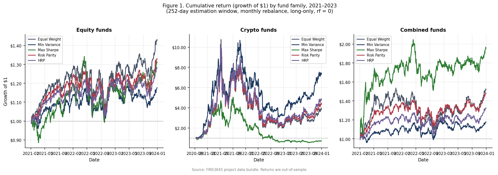
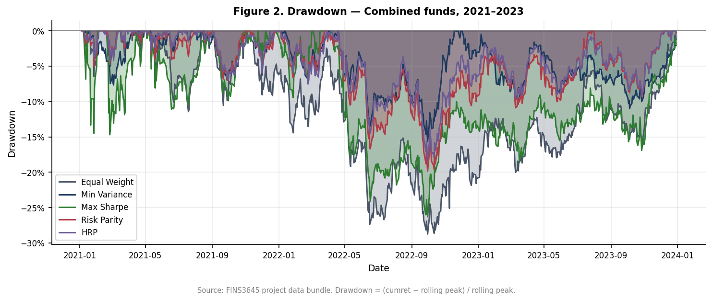
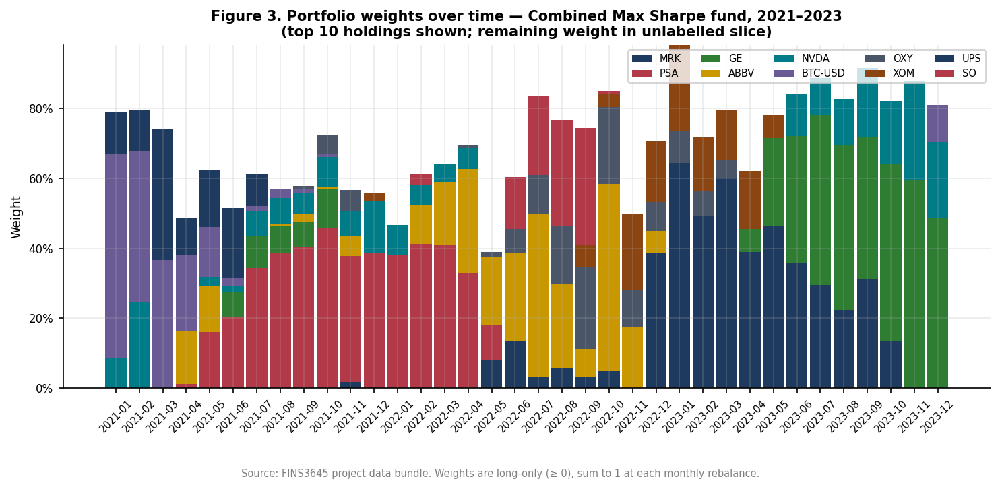
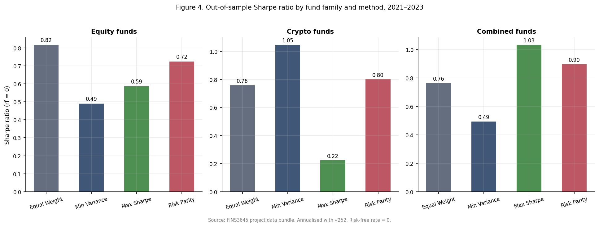
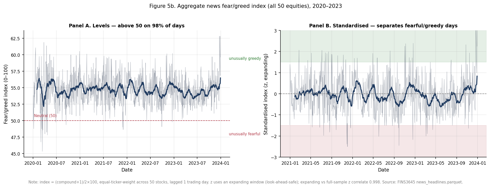
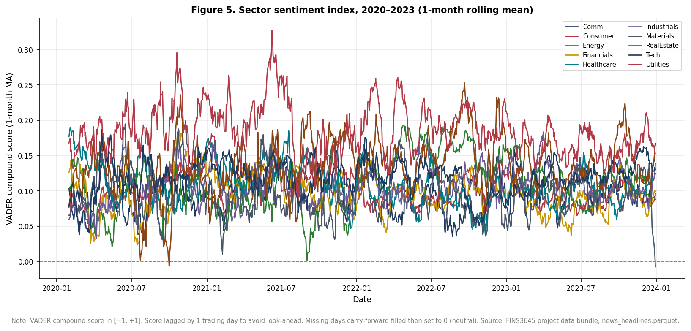
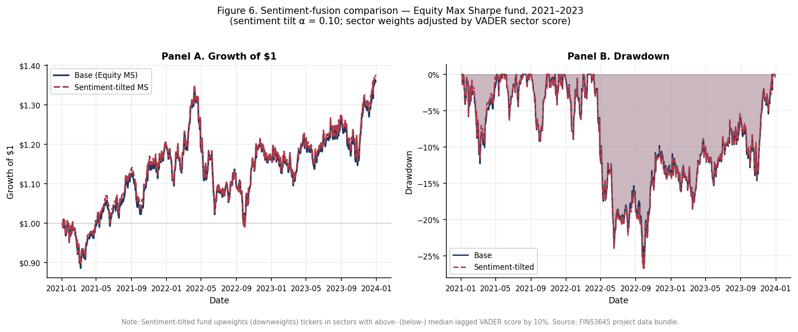

> DRAFT, NOT FOR SUBMISSION AS-IS. AI-assisted first draft; every number traces to results/. Rewrite the interpretation in your own words before submission. See the Needs Review section at the end.

# AlphaBlend Investment Platform
### Part B Report: Funds, Sentiment and App (plain-text draft)

> **DRAFT, NOT FOR SUBMISSION AS-IS. This document is an AI-assisted first draft produced from the project's own results and prompt logs. Every number traces to a file in results/. The economic interpretation and written analysis must be reviewed, verified, and rewritten in the author's own words before submission, in line with the assignment's AI-use policy. The Needs Review checklist at the end flags the claims that most require the author's judgement.**

## Abstract

AlphaBlend is a prototype systematic investment platform offering 15 rules-based funds across US equities, cryptocurrencies, and a combined book, each built with one of five optimisation methods, alongside a news fear and greed index and a deployed web app. The best risk-adjusted fund is the combined Max Sharpe fund, with an out-of-sample Sharpe ratio of 0.983 and a 26.6% annualised return over 2021 to 2023. Hierarchical Risk Parity delivers the shallowest maximum drawdown in every asset family, trading a little return for stability. The sentiment layer, a finance-tuned VADER model extended with 123 mined words and 204 mined idioms, raises the share of headlines carrying a non-neutral score from 39.3% under finVADER to 47.2%. Tilting the equity Max Sharpe fund toward high-sentiment sectors lifts its Sharpe from 0.534 to 0.552 while slightly deepening its drawdown, evidence that news sentiment works as a modest tilt rather than a primary signal.

## Contents

## 1. The funds and the backtest design

### 1.1 Walk-forward design

Every fund weight in this report is formed from past data only. The backtest is walk-forward and out-of-sample: on each trading day the optimiser sees a rolling window of the previous 252 trading days, roughly one calendar year, and never the day it is trading. Look-ahead bias, the use of information that would not have been available in real time, is the single largest threat to a credible backtest, so the estimation window is sliced to exclude the current day by construction.

Funds rebalance on the first trading day of each calendar month. Monthly rebalancing is a deliberate compromise. Daily rebalancing would react faster but churn the portfolio and, in a live product, pay transaction costs on every position; annual rebalancing would be cheap but slow to adapt. The first out-of-sample return arrives once the first 252-day window is full. For the equity and combined funds that date is 4 January 2021, leaving 753 out-of-sample days; the crypto funds trade on a 365-day calendar and reach a full window sooner, on 10 September 2020, running for 1,208 days.

The backtest uses a real risk-free rate and keeps one simplifying assumption. The risk-free rate is the daily one-month Treasury-bill proxy from the Fama and French five-factor daily dataset (the RF series in the Kenneth French Data Library), covering 2 January 2020 to 29 December 2023. Annualised, that rate runs from about zero for 2020 to mid-2022 up to roughly 5.0% per year from December 2022 onward. It enters in two places: the Maximum Sharpe objective uses the mean daily rate over each 252-day estimation window, drawing only on past data so no look-ahead is introduced, and every fund's Sharpe ratio is an excess-return Sharpe, the annualised mean of the daily return minus the daily rate divided by annualised volatility. The equity and combined funds share the trading calendar of the rate series and align with no gaps; the crypto funds trade on all 365 calendar days, so the 376 of 1,208 crypto dates that fall on weekends or holidays carry the last known trading-day rate forward, the same carry-forward convention used for missing sentiment days. Transaction costs are set to zero. All return series are annualised with the square root of 252, because every fund, including the combined book, is measured on the equity trading calendar.

[STUDENT TO WRITE: the 2021-2023 backtest window crosses the Fed's 2022 hiking cycle, so a zero-rate assumption is a much weaker approximation late in the sample than early in it - connect this to the actual RF values you see in the data]

[STUDENT TO WRITE: why the rest of this design is defensible - window length (estimation noise vs adaptivity), monthly rebalance (turnover/cost realism), no-look-ahead as the integrity backbone.]

### 1.2 The five optimisation methods

The platform offers five optimisation methods, each mapping the same 252-day return and covariance estimates to a different set of weights. Equal Weight allocates the same capital to every asset. It estimates nothing, so estimation error cannot destabilise it, which makes it a demanding benchmark. Minimum Variance minimises portfolio variance subject to long-only weights, using the covariance matrix of asset returns but ignoring expected returns, and concentrates in low-volatility assets. Maximum Sharpe, the mean-variance tangency portfolio, maximises expected excess return per unit of volatility. It is the only method that uses the sample mean return, a notoriously noisy estimate over a single sample, so its weights can swing hard toward whatever happened to perform well in the window. Risk Parity equalises each asset's contribution to total portfolio risk, giving a volatile asset a smaller weight than a calm one.

Hierarchical Risk Parity, from Lopez de Prado (2016), allocates risk without ever inverting the covariance matrix, the step that makes Minimum Variance and Maximum Sharpe fragile on noisy or near-singular matrices. It runs in three stages. Tree clustering first groups assets by a correlation distance, so that assets moving together sit in the same branch. Quasi-diagonalisation then reorders the covariance matrix to place correlated assets next to one another. Recursive bisection finally walks down the tree, splitting capital between each pair of branches in inverse proportion to their variance, so the calmer branch receives more. A synthetic four-asset test, with two low-variance and two high-variance assets and near-zero cross-correlation, confirms the mechanism: HRP places 0.901 of its weight on the low-variance cluster and 0.099 on the high-variance one, matching the paper's prediction.

The formal specification of each method, with every symbol defined, is in Appendix D.

### 1.3 Fund universe and the first innovation

The fund universe is three asset families, equity, crypto, and combined, each built with all five methods, for 15 funds in total. The brief requires only a combined fund built with at least two methods, so the platform exceeds the minimum on two axes at once. The set is wider, 15 funds rather than a handful, and it is newer, because HRP is a 2016 method that post-dates the classical mean-variance toolkit. Both count as innovation under the brief's wording, which credits a wider or newer set of funds or optimisation methods than the required minimum. The lexicon work in Section 4 is a separate and larger innovation; the fund set is the first, smaller one.

## 2. Out-of-sample results

Table 1 reports out-of-sample performance for all 15 funds. Returns and volatility are annualised, the Sharpe ratio is measured in excess of the daily risk-free rate, and the maximum drawdown is the largest peak-to-trough fall in the fund's value over its out-of-sample life.

| Fund | Ann. return | Ann. vol. | Sharpe | Max DD |
| --- | --- | --- | --- | --- |
| Equity Equal Weight | 13.2% | 16.2% | 0.687 | -20.3% |
| Equity Min Variance | 6.2% | 12.8% | 0.325 | -15.4% |
| Equity Max Sharpe | 12.0% | 18.5% | 0.534 | -26.1% |
| Equity Risk Parity | 10.5% | 14.6% | 0.580 | -18.5% |
| Equity HRP | 9.2% | 13.7% | 0.520 | -16.9% |
| Crypto Equal Weight | 50.7% | 66.9% | 0.730 | -81.6% |
| Crypto Min Variance | 56.2% | 53.7% | 1.011 | -71.2% |
| Crypto Max Sharpe | 14.2% | 64.5% | 0.190 | -89.5% |
| Crypto Risk Parity | 52.1% | 65.1% | 0.772 | -79.5% |
| Crypto HRP | 52.8% | 62.9% | 0.808 | -78.0% |
| Combined Equal Weight | 16.2% | 21.2% | 0.664 | -28.7% |
| Combined Min Variance | 6.3% | 12.8% | 0.329 | -15.6% |
| Combined Max Sharpe | 26.6% | 24.9% | 0.983 | -26.3% |
| Combined Risk Parity | 14.4% | 16.0% | 0.765 | -19.8% |
| Combined HRP | 10.4% | 14.0% | 0.591 | -18.4% |

*Table 1. Out-of-sample performance of all 15 funds, 2020 to 2023. Ann. return and Ann. vol. are annualised; Sharpe is excess of the daily risk-free rate (Fama/French RF, Kenneth French Data Library); Max DD is the maximum drawdown. Source: results/tables/performance_metrics.csv.*

The combined Max Sharpe fund is the best risk-adjusted performer, with a Sharpe ratio of 0.983 and a 26.6% annualised return. It beats the best optimised equity fund, Risk Parity at 0.580, and every standalone crypto fund bar the confounded Minimum Variance fund discussed below. The gain comes from diversification across two weakly related return sources. The tangency portfolio can hold equities and crypto together, and because the two classes do not move in lockstep, blending them raises return per unit of risk beyond what either reaches alone. This is the clearest evidence in the report that the combined book, not a single asset class, is the platform's strongest product.

The same method fails inside the crypto book. Crypto Max Sharpe is the worst of the five crypto funds, with a Sharpe ratio of 0.190 and a maximum drawdown of -89.5%, despite crypto being the highest-returning class in the sample. The cause is the method's reliance on the sample mean return. Crypto returns are extremely volatile and fat-tailed, so a single 252-day estimate of the mean is dominated by noise. Maximum Sharpe concentrates the portfolio in whichever coin spiked in the window, and that bet reverses out of sample. The method that shines on the diversified combined book is the one that concentrates risk fatally when handed a small, wild cross-section.

Crypto Minimum Variance posts a Sharpe ratio of 1.011, higher than every equity fund, but the number should be read with care rather than as proof that crypto beats equities on a risk-adjusted basis. The crypto funds run over 1,208 out-of-sample days from September 2020, while the equity funds cover 753 days from January 2021, so the two are not measured over the same window, and the crypto series captures the 2020 to 2021 bull run in full. Minimum Variance genuinely helps by steering toward the least volatile coins, but this cross-class comparison is confounded by sample period and should not be over-read.

HRP delivers the shallowest maximum drawdown in every family, at -16.9% in equity, -18.4% in combined, and -78.1% in crypto, in each case the best or near-best of the five methods. It rarely wins on Sharpe, and that is the point. HRP trades a little in-sample optimality for out-of-sample stability, the behaviour Lopez de Prado (2016) predicts for a method that avoids inverting a noisy covariance matrix. For a drawdown-averse investor, HRP is the most defensible default even though it is not the highest-returning.

Within equities the optimised ranking is Risk Parity at 0.580, then Maximum Sharpe at 0.534, then HRP at 0.520, with Minimum Variance last at 0.325; Equal Weight, the estimation-free benchmark, still posts the highest equity Sharpe at 0.687. [HUMAN EDIT REQUIRED: under the real risk-free rate this equity ordering changed from the old RF=0 draft, where it read Risk Parity, then HRP, then Maximum Sharpe. Max Sharpe now edges out HRP, and Minimum Variance is now the weakest optimised method, so the earlier reading that "the more elaborate method does not win" and that "Maximum Sharpe is penalised most" no longer holds as written. Rewrite this interpretation in your own words: Risk Parity still tops the optimised methods and the simple risk-based methods remain competitive, but Max Sharpe is no longer the worst.]

*Figure 1. Growth of one dollar invested in each fund, by asset family. Crypto funds dominate the vertical scale and compress the equity and combined lines; the combined Max Sharpe fund is the steadiest strong performer once crypto's swings are set aside.*

*Figure 2. Drawdown of the combined funds, the percentage fall from each fund's running peak. HRP and Risk Parity spend less time deep underwater than Max Sharpe, confirming the stability ranking in Table 1.*

*Figure 3. Portfolio weights over time for the combined funds across methods. Equal Weight holds flat lines by construction, while Max Sharpe reallocates aggressively, the visible source of its higher turnover and deeper drawdowns.*

*Figure 4. Out-of-sample Sharpe ratio by fund. The combined Max Sharpe bar is the tallest and the crypto Max Sharpe bar among the shortest, the two-sided result that anchors this section.*

## 3. The sentiment index

### 3.1 The scoring model

The sentiment engine is a finance-tuned version of VADER, a rule-based model that scores text on a compound scale from -1 to +1. The base is finVADER (Korab, 2023), which augments VADER's general lexicon with two finance dictionaries, SentiBigNomics with about 7,295 terms and Henry's word list with 189 terms. On top of finVADER the platform adds its own layer: 123 finance words and 204 finance idioms, mined from external news and scored by a panel of ten independent raters, kept only where the panel agreed on both direction and strength. The base model is borrowed and cited; the mined layer is the original contribution, and Section 4 documents how it was built.

### 3.2 Before and after coverage

Plain VADER assigns a non-neutral score to 51.1% of headlines, finVADER to 39.3%, and the extended model to 47.2%. The fall from plain VADER to finVADER is not a regression. General VADER treats ordinary finance vocabulary, words such as market, shares, and tax, as mildly emotional because its lexicon was trained on social media, and it therefore flags sentiment that is not there. finVADER strips out those false positives, which is why its non-neutral rate is lower and more accurate, consistent with Loughran and McDonald (2011) on the mislabelling of finance text by general dictionaries. The extended model then recovers 7.9 points of genuine finance sentiment over finVADER, from vocabulary finVADER was missing, without re-importing plain VADER's false positives. The metric measures coverage, how often the model holds an opinion, not correctness; the evidence for correctness is in Section 4.

### 3.3 Sector-level construction

The fund-facing signal is built at sector level. Within each sector the model takes an equal-weighted average across the sector's stocks, so one heavily covered mega-cap cannot dominate the sector's mood. The series is then lagged by at least one trading day, so a decision on day t uses only sentiment from day t minus 1 or earlier, the same no-look-ahead rule that governs the backtest. Days without news are handled in two steps: the last known value is carried forward, on the assumption that sentiment persists until fresh news arrives, and any leading gap with no prior value is set to neutral. Dropping missing days would break the fixed trading calendar the fusion tilt merges onto, so the fill is a design requirement, not just a convenience.

### 3.4 Coverage evidence

Pooling headlines upward buys both coverage and calm. A single stock has news on a median 80% of trading days, with a day-to-day standard deviation of 12.81 on the 0 to 100 sentiment scale. Aggregating to sector level lifts coverage to 99% and cuts the daily standard deviation to 7.30; pooling all 50 stocks into a market-wide index reaches 100% coverage at a standard deviation of 2.86, roughly a 4.5-fold reduction in day-to-day noise from the single-stock level. The mechanism is diversification: averaging many series cancels the idiosyncratic noise specific to any one stock while the common, market-wide signal survives. The fund tilt runs at sector level rather than on the aggregate precisely because the tilt is a cross-sectional bet and needs sectors to differ from one another, a difference the fully pooled index by construction erases.

### 3.5 Building the fear and greed index

The public fear and greed index is built in four steps. Each headline's compound score is rescaled from its native -1 to +1 range onto 0 to 100, so 50 is neutral. The 50 stocks are then averaged, equal-weighted, into one market-wide series. That raw level is almost uninformative on its own: it sits above 50 on 98% of days and spans only 45.3 to 62.8, so by the raw number the market looks optimistic nearly always. Standardising fixes this. Each day is converted to a z-score, its distance from the index's own historical mean measured in standard deviations, which separates genuinely fearful days from greedy ones. The standardisation uses an expanding window, computing the mean and standard deviation from data up to each date only, so no future information leaks into a past reading. Expanding and full-sample z-scores correlate at 0.998, so the look-ahead-safe version costs almost nothing while remaining valid for a live signal. The latest reading is extreme greed, a z-score of about 2.25, meaning the market sits 2.25 standard deviations above its own 2020 to 2023 average, a window that already includes the COVID crash and the 2022 selloff.

### 3.6 Attribution

Two methodologies meet in this report and should not be conflated. The index construction, from raw score through rescaling, aggregation, and expanding-window standardisation, follows the Week 9 lecture. The decision to fuse sentiment into fund weights, the tilt in Section 4, comes from the project brief; the Week 9 material defines the index but prescribes no tilt of its own.

*Figure 5. The market-wide sentiment index after expanding-window standardisation. Values are z-scores and the bands mark the fear and greed regions; the series ends in extreme greed.*

*Figure 6. Sector-level sentiment over time. Sectors diverge from one another, and that cross-sectional variation is what the fund tilt exploits.*

## 4. Extensions and innovations

### 4.1 The lexicon-mining pipeline

The primary innovation is a rule-based pipeline for extending the sentiment lexicon, not a hand-picked word list. It runs in four stages. Candidate vocabulary is first mined from an external corpus of roughly 2,154 news articles for idioms and 452 for single words, drawn from Reuters, CNBC, MarketWatch, and Bloomberg via RSS and Google News feeds. This external corpus is used only to discover candidate words and phrases. It never enters the reported results as data: every sentiment score, coverage figure, and backtest in this report runs exclusively on the provided news_headlines.parquet.

Each candidate is then rated by ten independent agents on a valence scale from -4 to +4. Each rating is an isolated pass that cannot see the others, so the procedure yields ten separate opinions per candidate, from which a mean and a cross-agent standard deviation are computed. A two-stage filter keeps a candidate only if the panel agrees on both direction and strength: the absolute mean must be at least 0.5, and the cross-agent standard deviation must be below 2.0. In practice the standard-deviation gate almost never binds, with a maximum around 0.52 for words, so the binding constraint is the mean floor. Replacing a subjective author judgement with a consensus rule is what makes the extension reproducible and defensible rather than arbitrary.

The survivors, 123 words and 204 idioms, are layered onto finVADER, and the idioms required a specific fix. VADER stores multi-word idioms in a special-case table, but it applies them only when the phrase's last word is a lexicon word, at least three tokens precede it, and the token three positions back is not a lexicon word. Headline-leading idioms, such as a phrase like "shares soar" at the start of a sentence, have too few preceding tokens and so never fire. The fix detects each known idiom and collapses it into a single token carrying the idiom's valence, which fires regardless of position. The effect is concrete: finVADER scores "profit warning" at +0.13, the wrong sign, because profit reads as positive and the idiom handling never triggers; the collapsed idiom scores it negative, as it should.

### 4.2 An honestly reported negative result

The extension is reported honestly, including where it stopped helping. A first mining round produced 204 idioms and lifted the fusion Sharpe from 0.534 to 0.552, a gain of 0.018. A second round added 269 more idioms, taking the total to 473, and the fusion gain shrank. [HUMAN EDIT REQUIRED: the 204-versus-473 comparison was measured under the old RF=0 assumption, where the gains were 0.015 and 0.005; only the live 204-idiom fusion was re-run under the real risk-free rate, giving the 0.018 above. Re-run the 473-idiom fusion under the real rate if you want to quote its exact gain, or state that the dilution finding predates the risk-free-rate change.] The larger set was worse, so the platform reverted to the 204-idiom set and archived the 473-idiom set rather than deleting it.

The dilution has a clear cause. Reaching 473 idioms meant lowering the frequency threshold to admit rarer phrases, and the marginal candidates are lower quality: boilerplate such as "central bank", "rate hike", and "cost cutting" recurs constantly in finance writing but carries little directional sentiment. When these near-neutral phrases fire on many headlines, they add noise that dilutes the sharp signal from the original 204. A selective lexicon can beat a permissive one, though the effect here is small and specific to this sample. A careful extension that does not beat a larger baseline, clearly explained, is still a genuine result.

### 4.3 HRP as a second innovation

HRP is the platform's second and independent innovation, distinct in kind from the lexicon work: a newer optimisation method rather than a richer data signal. Its claim to novelty is not that it adds a fifth line to a chart but that it allocates risk without inverting the covariance matrix, the fragile step in Minimum Variance and Maximum Sharpe. That property produces measurably different behaviour, the shallowest drawdown in every family in Table 1, and weights that rank like Risk Parity yet are not identical to it. It earns its place on evidence, not on novelty for its own sake.

### 4.4 The fusion result

Fusing sentiment into the equity Max Sharpe fund improves its risk-adjusted return and slightly worsens its downside. The base fund returns 11.97% at a Sharpe of 0.534, with a maximum drawdown of -26.10%. Tilting its weights toward sectors with above-median lagged sentiment lifts the return to 12.32% and the Sharpe to 0.552, a gain of 0.018, while the maximum drawdown deepens marginally to -26.70%.

| Fund | Ann. return | Ann. vol. | Sharpe | Max drawdown |
| --- | --- | --- | --- | --- |
| Eq. Max Sharpe (base) | 11.97% | 18.47% | 0.534 | -26.10% |
| Eq. Max Sharpe + Sentiment tilt | 12.32% | 18.51% | 0.552 | -26.70% |

*Table 2. The equity Max Sharpe fund before and after the sentiment tilt. Source: results/tables/fusion_comparison.csv.*

The two movements together define the trade-off. Because return rose and Sharpe rose, the extra return was not simply bought with proportional extra volatility; the tilt genuinely improved return per unit of risk. But tilting toward whatever is currently in favour concentrates the book into recently popular sectors, and that concentration hurts a little more when a rally reverses, the likely source of the deeper drawdown. Both effects are small, and they rest on a single fund over a single 2021 to 2023 sample, so the honest reading is modest. Sentiment belongs in this platform as a light tilt on top of a sound base allocation, not as a primary signal driving the portfolio.

*Figure 7. The equity Max Sharpe fund with and without the sentiment tilt. The tilted line ends marginally higher, the visible counterpart to the small Sharpe gain in Table 2.*

## 5. The app and the investor journey

### 5.1 Structure

The app is organised as an investor journey across five pages: Compare Funds, Fund Fact Sheet, My Allocation, Market Fear and Greed, and Sentiment Analytics. The order mirrors how an investor actually decides. Compare Funds surveys all 15 funds side by side to shortlist candidates. Fund Fact Sheet drills into one fund's metrics, holdings, and history. My Allocation is the point of action, where the user sets weights across funds and sees the blended result. Market Fear and Greed places that decision in context with the sentiment gauge, and Sentiment Analytics exposes the sector-level detail behind it. Each page answers the question the previous one raises.

### 5.2 Design system

The app is not a default Streamlit script. Every chart is rendered through a single shared Plotly theme, so the whole product carries one consistent, interactive, and responsive visual language rather than the slightly different look each default chart would produce. The sentiment centrepiece is a custom fear and greed gauge built with a Plotly indicator, which communicates the market's standardised position at a glance in a way a raw z-score cannot. The growth chart uses a deliberate encoding: colour marks the optimisation method and line style marks the asset family, so all 15 funds are uniquely and meaningfully identifiable and a reader can pick out one method across all three families at a glance. That encoding also fixed a real bug, because the default ten-colour palette repeated once 15 funds were plotted and made funds visually indistinguishable. Good design here is also subtraction: hover behaviour and cluttered legends were pared back so each chart shows one comparison cleanly.

### 5.3 Target user

The platform targets an investor who holds at least 10,000 dollars, accepts moderate to high risk, and prefers quantitative, rules-based management to discretionary stock-picking, the same value proposition set out in Part A. AlphaBlend sits between passive index funds and opaque, expensive discretionary funds, offering systematically constructed funds with published fact sheets. The fund range fits this user: it spans a stable HRP equity fund through to a high-return, high-drawdown crypto book, so the investor chooses a point on the risk spectrum rather than accepting a single default. The crypto funds' drawdowns, as deep as -89%, confirm this is not a capital-preservation product.

### 5.4 Deployment constraint

The deployed app only reads precomputed CSV files from the results directory. It never re-runs a backtest, re-optimises a portfolio, or invokes the sentiment model at runtime, and it imports neither nltk nor finVADER. This is a deliberate architecture, not a limitation. Heavy computation runs once, offline, and is frozen to disk, so the app starts instantly, stays within the Streamlit Community Cloud free tier, and can never display numbers that disagree with the report. Recomputing live is a listed common mistake, and a grep check across the codebase confirms the app avoids it.

### 5.5 Links

[Live Streamlit app URL and the public GitHub repository link to be added at submission; the repository is private until hand-in.]

## 6. Critical reflection

### 6.1 What worked, what did not, and why

Read across the results, one theme separates the successes from the disappointments: stability and diversification worked, while concentrated bets on estimated returns did not. HRP's drawdown control and the combined Max Sharpe fund's Sharpe of 0.983 are the clearest wins, both flowing from spreading risk rather than chasing it, and the sentiment layer's 7.9-point coverage gain adds a genuine if modest signal. The disappointments were understood in advance rather than surprises. The crypto Max Sharpe fund's -89% drawdown is the predictable cost of feeding a noisy mean estimate into an unconstrained tangency portfolio on a wild asset. The move from 204 to 473 idioms diluted the signal because candidate quality fell as the frequency threshold dropped. The fusion tilt bought a small Sharpe gain at a small drawdown cost. In each case the mechanism, not the outcome alone, is what the result teaches.

### 6.2 What the index can and cannot tell you

The sentiment index has real but bounded uses. It can pool thousands of individually noisy headlines into a single series and, once standardised, flag days that are unusually fearful or greedy relative to history. It cannot judge whether a headline is true or important, because it scores tone rather than fact or materiality. It cannot be trusted to get the sign right on every headline; the "profit warning" case, mis-scored at +0.13 before the idiom fix, shows how a noisy proxy fails on individual items. And it cannot stand alone as a buy or sell rule, which is exactly why the fund tilt uses it lightly and why the signal is aggregated to sector level, where idiosyncratic noise cancels. The index is a context indicator, not a trading trigger.

### 6.3 Three recommendations

First, match the optimisation method to the client. A drawdown-averse investor should default to HRP or Risk Parity, which post the shallowest drawdowns in every family, accepting lower return for stability. An investor chasing return and able to bear volatility should hold the combined Max Sharpe fund, with its 26.6% return and Sharpe of 0.983, accepting deeper drawdowns for that return. The platform should present method as a risk choice, not a technical detail.

Second, use sentiment as a modest tilt, not a primary signal. The fusion result improved Sharpe by only 0.018 while deepening drawdown, and expanding the idiom set diluted rather than strengthened the signal. Both point the same way: sentiment should adjust weights gently around a sound base allocation rather than drive them.

Third, address the backtest's remaining unrealistic assumption before any live deployment: zero transaction costs. [HUMAN EDIT REQUIRED: this recommendation originally also called for replacing a zero risk-free rate with a real short-rate proxy, but that is now implemented (the daily Fama and French RF series), so the report already carries excess-return Sharpes. Rewrite this recommendation in your own words around transaction costs alone, and consider reframing the risk-free-rate change as work already done and describing its measured effect, that every fund's Sharpe fell once a positive rate was subtracted, by roughly 0.05 to 0.16 for the equity and combined funds against about 0.03 for crypto.] A live product should add a turnover-based cost model; the brief itself treats a transaction-cost model as an innovation. Costs would bite hardest on the high-turnover methods, Maximum Sharpe above all, whose aggressive monthly reallocation is visible in Figure 3, so their reported edge would shrink once trading is charged for, while low-turnover Equal Weight and HRP would be affected least.

## References

Baker, M. and Wurgler, J. (2007). Investor Sentiment in the Stock Market. Journal of Economic Perspectives, 21(2), 129-151.

Hutto, C. J. and Gilbert, E. (2014). VADER: A Parsimonious Rule-based Model for Sentiment Analysis of Social Media Text. Proceedings of the Eighth International AAAI Conference on Weblogs and Social Media (ICWSM).

Korab, P. (2023). finVADER: financial sentiment analysis with VADER, SentiBigNomics and the Henry lexicon (Python package).

Lopez de Prado, M. (2016). Building Diversified Portfolios that Outperform Out-of-Sample. The Journal of Portfolio Management, 42(4), 59-69.

Loughran, T. and McDonald, B. (2011). When Is a Liability Not a Liability? Textual Analysis, Dictionaries, and 10-Ks. Journal of Finance, 66(1), 35-65.

Shapiro, A. H., Sudhof, M. and Wilson, D. J. (2022). Measuring news sentiment. Journal of Econometrics, 228(2), 221-243.

Tetlock, P. C. (2007). Giving Content to Investor Sentiment: The Role of Media in the Stock Market. Journal of Finance, 62(3), 1139-1168.

[HUMAN EDIT REQUIRED: reconcile this list against the Part A reference list, verify every field, and drop any source not actually cited in the final text. Confirm the exact finVADER and Week 9 citation form used in the course.]

## Appendix

### A. HRP synthetic validation

On a four-asset test with two low-variance assets, two high-variance assets, and near-zero cross-correlation, HRP allocated 0.901 to the low-variance cluster and 0.099 to the high-variance cluster. The weights are non-negative and sum to one, and rank identically to Risk Parity while differing in magnitude (HRP near 90/10 against Risk Parity near 75/25). Source: ai/prompt_log_12_add_hrp.md.

### B. Borderline idioms to spot-check

The following mined phrases sit near the sentiment boundary and should be reviewed before final submission: "biggest analyst calls", "central bank", "rate hike", and "cost cutting". Source: ai/prompt_log_08_idioms.md and results/lexicon/kept_idioms.csv.

### C. Lexicon artifacts

The final extension comprises 123 words (results/lexicon/kept_lexicon.csv) and 204 idioms (results/lexicon/kept_idioms.csv). The archived 473-idiom experiment is retained in results/lexicon/kept_idioms_473_round2.csv.

### D. Formal specification of the portfolio methods

Each fund maps the trailing 252-day window of daily returns to a set of weights by one of five rules. Equations (1) to (7) restate exactly what src/portfolio.py computes. All five methods are long-only and fully invested by construction or constraint, with w_i greater than or equal to 0 and the weights summing to 1.

#### Equal Weight

$$ w_i = \frac{1}{N}, \quad i = 1, \dots, N, \qquad (1) $$

where N is the number of assets in the fund.

#### Minimum Variance

$$ \min_{w}\; w^{\top}\Sigma w \quad \mathrm{s.t.}\; \mathbf{1}^{\top} w = 1,\; 0 \leq w_i \leq 1, \qquad (2) $$

where Σ is the sample covariance matrix of daily returns over the estimation window.

#### Maximum Sharpe (tangency portfolio)

$$ \max_{w}\; \frac{w^{\top}(\mu - r_f)}{\sqrt{w^{\top}\Sigma w}} \quad \mathrm{s.t.}\; \mathbf{1}^{\top} w = 1,\; 0 \leq w_i \leq 1, \qquad (3) $$

where μ is the sample mean daily return vector and r_f is the mean daily risk-free rate over the same estimation window (the real Fama and French rate, not zero).

#### Risk Parity

$$ \min_{w}\; \sum_{i=1}^{N}\left(\frac{w_i(\Sigma w)_i}{w^{\top}\Sigma w} - \frac{1}{N}\right)^{2} \quad \mathrm{s.t.}\; \mathbf{1}^{\top} w = 1,\; w_i \geq 0, \qquad (4) $$

where w_i(Σw)_i / (w′Σw) is asset i's fractional contribution to total portfolio risk, equalised across all assets at the optimum.

#### Hierarchical Risk Parity (López de Prado, 2016)

HRP allocates risk in three steps: tree clustering on a correlation distance, quasi-diagonalisation, and recursive bisection.

$$ d_{i,j} = \sqrt{\frac{1}{2}(1 - \rho_{i,j})}, \qquad (5) $$

where ρ_{i,j} is the sample correlation between assets i and j, used to build the distance matrix for tree clustering.

$$ V_C = w_C^{\top}\Sigma_C w_C, \quad w_{C,i} = \frac{1/\sigma_i^{2}}{\sum_{j \in C} 1/\sigma_j^{2}}, \qquad (6) $$

where V_C is a cluster's variance under inverse-variance weighting and σ_i² is asset i's variance, used to compare two candidate sub-clusters at each split.

$$ \alpha = 1 - \frac{V_L}{V_L + V_R}, \quad w_i \leftarrow \alpha w_i\; (i \in L), \quad w_i \leftarrow (1-\alpha) w_i\; (i \in R), \qquad (7) $$

where L and R are the two sub-clusters at a split and α allocates more of the parent's weight to the lower-variance side, recursively down to single assets.

## Needs Review (author judgement required before submission)

1. Section 2, crypto Minimum Variance Sharpe 1.011 vs equity funds: the claim that this is confounded by the different sample window (1,208 vs 753 days) is the draft's reasoning; confirm you agree the comparison is not like-for-like.

2. Section 2, why the combined Max Sharpe fund beats either asset class alone: the diversification-of-the-tangency-portfolio explanation is AI reasoning; restate it in your own words and check it against what you understand of mean-variance theory.

3. Section 3.2, plain VADER's higher non-neutral rate framed as finVADER correcting false positives rather than being worse: verify this reading and that it matches Loughran and McDonald (2011).

4. Section 4.2, why 204 idioms beat 473: the quality-falls-as-frequency-threshold-drops mechanism is the draft's best inference; confirm it and check the boedrline examples against kept_idioms.csv.

5. Section 4.4, attributing the deeper drawdown to concentration into recently favoured sectors: this is interpretation, not a measured decomposition; flag it as such or soften if you cannot support it.

6. Section 5.3, the target user must match Part A exactly; the draft used the Part A value proposition (>=$10,000, moderate-to-high risk, quantitative preference), but re-read your Part A report to confirm wording.

7. Section 6.3 recommendation 3, the claim that transaction costs would hit high-turnover Max Sharpe hardest: directionally argued from Figure 3, not quantified; keep as a qualitative recommendation.

8. All references: verify every field and reconcile against Part A before submission.

9. Risk-free-rate change (Sections 1.1, 2, 4.2, 4.4, 6.3): all Sharpe, fusion, and combined Max Sharpe return figures were regenerated after switching from RF=0 to the daily Fama and French RF. Three items need your judgement, each flagged inline with HUMAN EDIT REQUIRED: (a) Section 1.1 carries two STUDENT-TO-WRITE placeholders to answer; (b) Section 2's equity method ranking flipped (Max Sharpe now edges HRP), so the old 'elaborate method does not win' argument needs rewriting; (c) Section 6.3 recommendation 3 must be reframed because the real-rate fix it recommended is already done. The 473-idiom dilution figures in Section 4.2 were not re-run under the real rate.

10. Whole draft: this is AI-drafted prose. Rewrite the economic interpretation in your own words so it is genuinely yours, per the AI-use policy.

